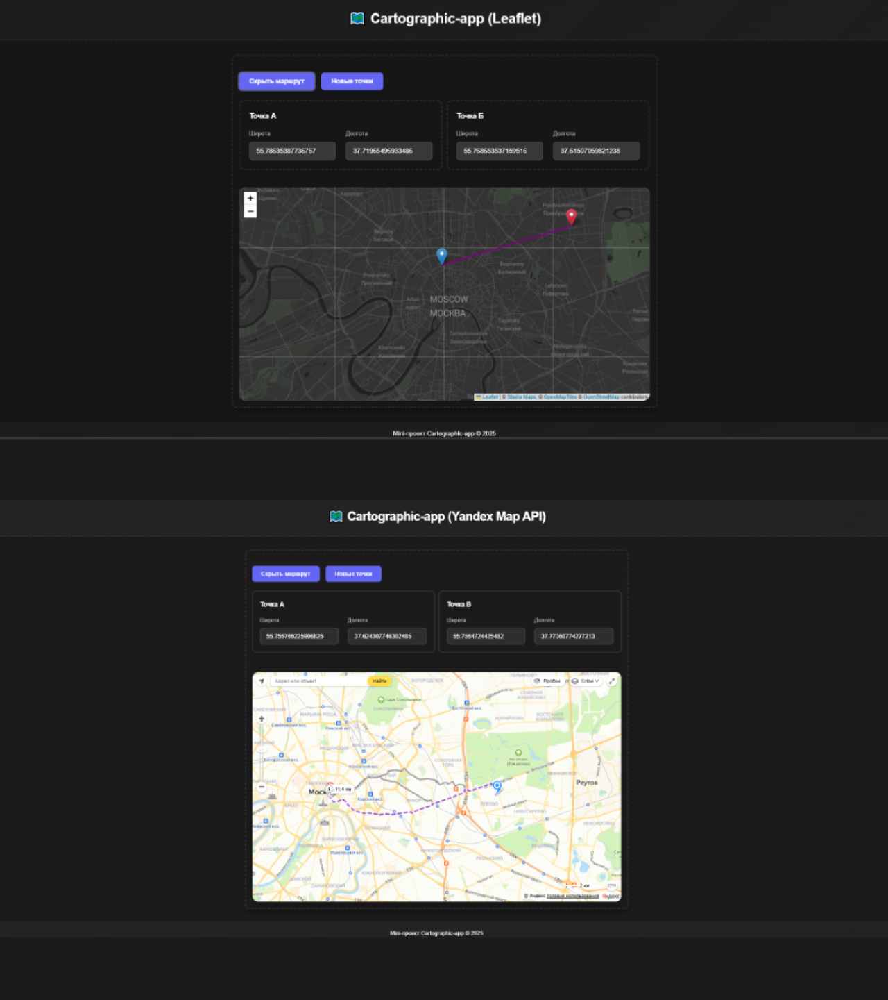
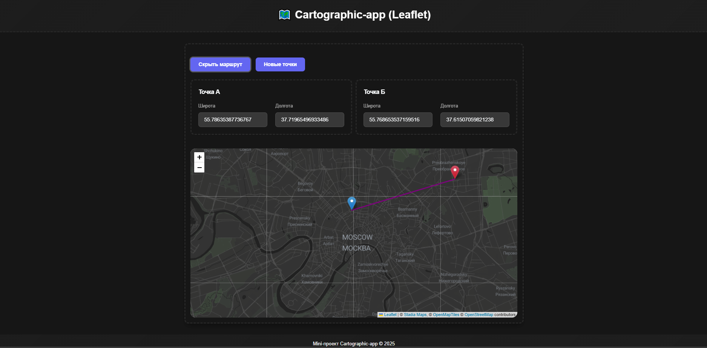
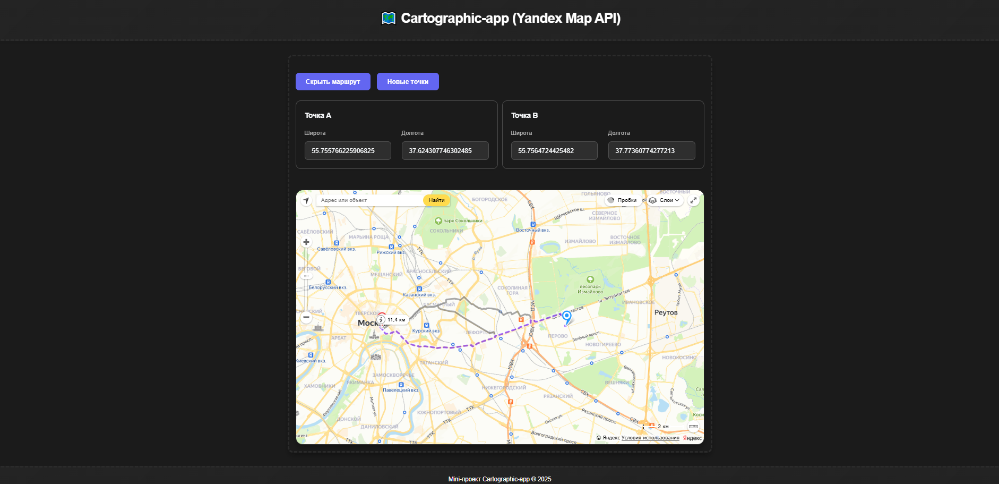

# 🗺️ Route Visualizer: Leaflet & Yandex Maps Versions

Проект для визуализации маршрутов с двумя реализациями:  
**🔸 Версия с Leaflet** — построение прямой линии между точками  
**🔸 Версия с Yandex Maps** — построение полноценного маршрута через API



## 🚀 Особенности

### **Версия с Leaflet (папка `/mapLeaflet`)**

-   Интерактивная карта с использованием Leaflet.js
-   Автоматическое построение прямой линии между точками

### **Версия с Yandex Maps (папка `/mapYandex`)**

-   Интеграция с Яндекс.Картами (API)
-   Построение маршрута между точками через сервис маршрутизации

## ⚙️ Установка

1. Клонировать репозиторий:

```bash
git clone https://github.com/Hamptooon/route-visualizer.git
```

2. Установить зависимости:

```bash
cd cartographic-app
cd mapLeaflet
npm i
cd ../mapYandex
npm i
```

3. Запустить нужную версию:

```bash
# Для Leaflet-версии
cd mapLeaflet
npm run start

# Для Yandex Maps-версии
cd mapYandex
npm run start
```

## 🔧 Конфигурация

### Для Yandex Maps:

1. Получите API-ключ на [Яндекс.Ключи для разработчиков](https://developer.tech.yandex.ru/services/)
2. Создайте файл `.env` в корне проекта (/src):

```env
YANDEX_MAPS_API_KEY=ваш_ключ_тут
```

## 🖼️ Примеры использования

### Leaflet Версия

  
_Прямые линии между произвольными точками_

### Yandex Maps Версия

  
_Реальные маршруты с рассчетом расстояния_

## 🛠 Технологии


